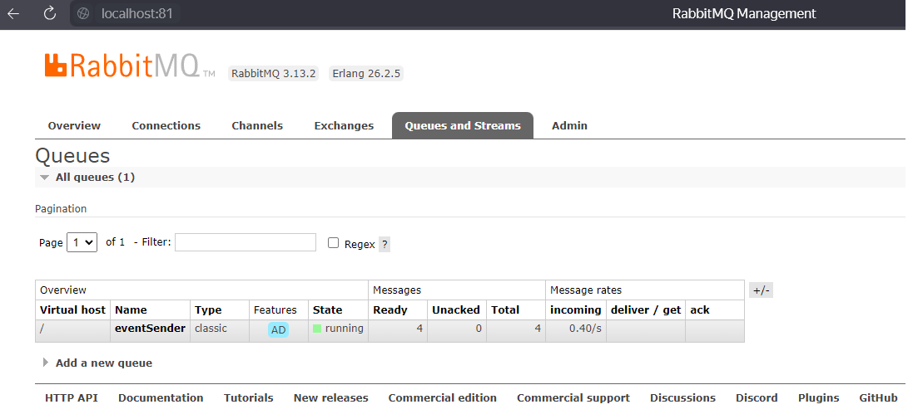
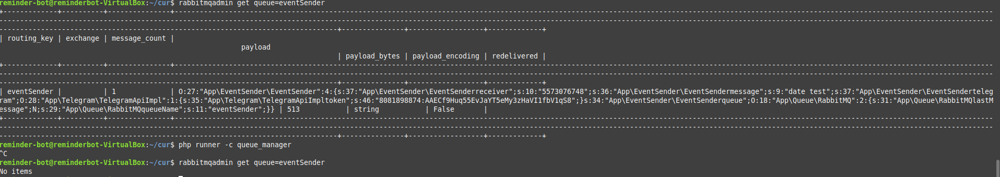
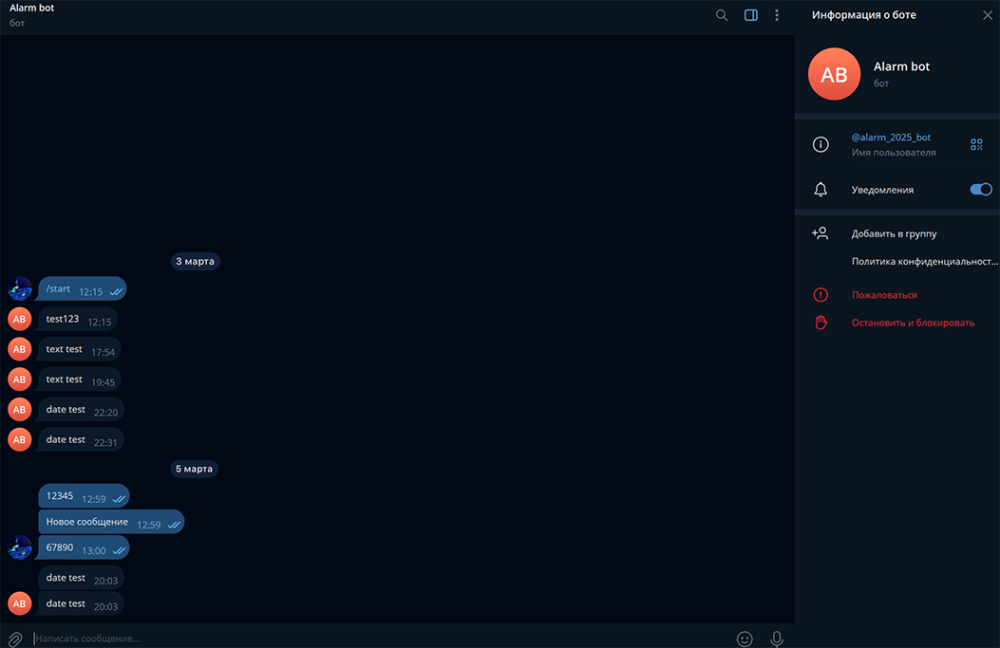

# reminger-tg-bot

# Telegram Reminder Bot с асинхронной обработкой событий (RabbitMQ + PHP)

[](https://php.net)
[](https://rabbitmq.com)
[](http://supervisord.org/)

## О проекте

Telegram-бот для напоминаний с асинхронной обработкой событий через RabbitMQ. Система состоит из нескольких взаимодействующих компонентов:

    Получатель команд (обработка входящих сообщений от пользователей)

    Постановщик задач (отправка событий в очередь RabbitMQ)

    Фоновые воркеры (демонизированные PHP-процессы под Supervisor, которые забирают задачи из очереди и выполняют их)

Ключевая архитектурная идея: отделение получения запросов от их обработки через брокер сообщений для повышения отзывчивости и отказоустойчивости.

## Архитектура и использованные паттерны

### Слои приложения

```
app/
├── Actions          // Бизнес-действия (например, EventSaver)
├── Commands         // Консольные команды (HandleEvents, QueueManager)
├── Queue            // Абстракция очередей + реализация RabbitMQ
├── Models           // Модели данных (Event, Model)
├── Database         // Работа с БД (SQLite)
├── Cache            // Кеширование (Redis)
└── EventSender      // Отправка событий потребителям
```
### Реализованные паттерны проектирования

    Command Pattern — каждая консольная команда (HandleEventsCommand, SaveEventCommand) инкапсулирует отдельную операцию, что обеспечивает гибкость и расширяемость системы

    Producer-Consumer Pattern — разделение ответственности: продюсеры (SaveEventCommand) ставят задачи в очередь, консьюмеры (HandleEventsDaemonCommand) их обрабатывают

    Competing Consumers (Конкурирующие потребители) — возможность запуска нескольких экземпляров воркера для параллельной обработки задач из одной очереди (балансировка нагрузки)

    Queueable Interface — унифицированный контракт для объектов, которые могут быть поставлены в очередь

    Repository Pattern — абстракция над хранилищем данных (SQLite), скрывающая детали реализации доступа к БД

    Daemon Pattern — реализация долгоживущих процессов под управлением Supervisor

### Как это работает (сценарий обработки напоминания)

  1.  Получение команды: пользователь отправляет Telegram-сообщение с командой /remind "Текст" 18:00
  2.  Постановка в очередь: команда SaveEventCommand создаёт задачу и публикует её в RabbitMQ exchange с routing key event.reminder
  3.  Буферизация: RabbitMQ помещает сообщение в очередь reminder_queue и хранит его до востребования
  4.  Обработка: демонизированный воркер (HandleEventsDaemonCommand) постоянно слушает очередь. При появлении задачи:

        Забирает сообщение из очереди

        Выполняет бизнес-логику (отправляет напоминание через Telegram API, сохраняет в SQLite)

        Подтверждает успешную обработку (ack) — только после этого RabbitMQ удаляет сообщение
  5.  Обработка сбоев: если воркер падает во время выполнения и не отправляет ack, RabbitMQ автоматически возвращает задачу в очередь для повторной обработки другим воркером
  6.  Масштабирование: можно запустить несколько воркеров, и RabbitMQ распределит задачи между ними (паттерн "конкурирующие потребители")

### Технологический стек

| Компонент | Назначение | Версия/Реализация |
|-----------|------------|-------------------|
| **PHP** | Основной язык разработки | 8.2 |
| **RabbitMQ** | Брокер сообщений, очередь задач | 3.x |
| **php-amqplib** | Клиентская библиотека для работы с RabbitMQ | ^3.0 |
| **Supervisor** | Демонизация PHP-воркеров (управление процессами) | 4.x |
| **SQLite** | Хранение данных о событиях и напоминаниях | 3.x |
| **Redis** | Кеширование (опционально, для будущего расширения) | 6.x |
| **Telegram Bot API** | Внешний API для взаимодействия с пользователями | — |
| **PHPUnit** | Модульное и интеграционное тестирование | 9.x |
| **Composer** | Управление зависимостями | 2.x |
| **Monolog** | Логирование работы воркеров (через Supervisor) | 2.x |

## Команды для выполнения задания

```
sudo apt update
sudo apt install composer
sudo apt install sqlite3
sudo apt-get install php8.2-xml
sudo apt install curl
sudo apt install php-curl
```

### Настройка RabbitMQ и библиотеки для PHP

```
sudo apt install rabbitmq-server
```

📌 Устанавливает сервер сообщений RabbitMQ, который используется для асинхронной обработки задач и обмена сообщениями между микросервисами.

```
sudo rabbitmq-plugins enable rabbitmq_management
```

📌 Включает плагин управления RabbitMQ через веб-интерфейс.

```
composer require php-amqplib/php-amqplib

```

📌 Устанавливает библиотеку php-amqplib, которая реализует протокол AMQP для работы с очередями сообщений в PHP.

### Настройка общей папки в виртуальной машине (VirtualBox)

```

sudo usermod -aG vboxsf user

```

📌 Добавляет пользователя в группу vboxsf, чтобы он имел доступ к общей папке VirtualBox.

### Конфигурация Supervisor для фонового процесса

Создать файл конфигурации для Supervisor:

> /etc/supervisor/conf.d

```

[program:worker]
process*name=%(program_name)s*%(process_num)02d

command=php8.2 /home/reminder-bot/cur/runner -c handle_events_daemon
// Запускает процесс на PHP 8.2, который выполняет обработку событий.

autostart=true
// Процесс запускается автоматически при старте системы.

autorestart=true
// Если процесс падает, Supervisor автоматически перезапускает его.

user=reminder-bot
// Запускает процесс от имени пользователя reminder-bot.

numprocs=1
// Оставляет один экземпляр процесса.

redirect_stderr=true
// Перенаправляет ошибки в стандартный лог-файл.

stdout_logfile=/var/log/worker
// Лог-файл, в который записывается вывод процесса.

```
## Демонстрация работы

*Скриншоты подтверждают успешную работу RabbitMQ и обработку очередей*




